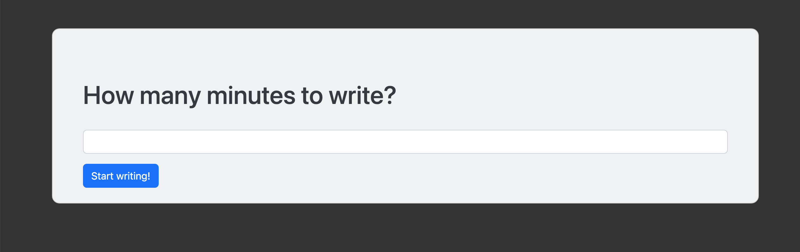
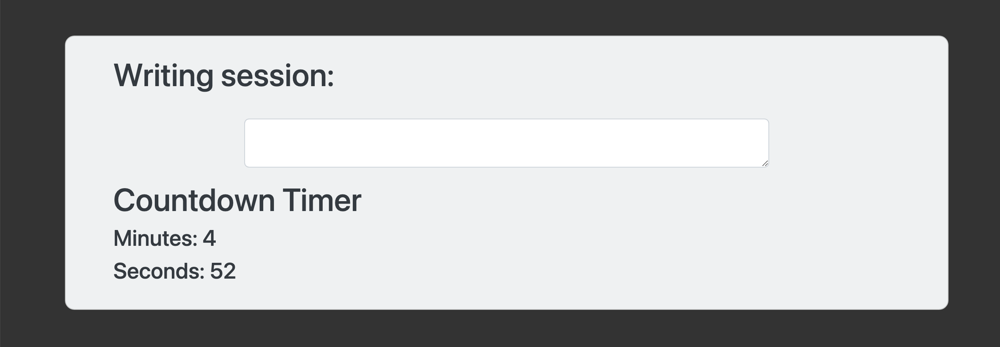

# Most Dangerous App (Flask App)

## 
### Description
This is Flask app version of the Most Dangerous Writing App that was originally developed by by software engineer [Manuel Ebert](https://github.com/maebert/themostdangerouswritingapp).
The App as the user on how many minutes they want to write and then direct them to the writing session with countdown timer. 

### Project motivation
I completed this portfolio website, as one of the assignments in professional [Python 100 Days bootcamp](https://www.udemy.com/course/100-days-of-code/) by [Dr. Angela Yu](https://github.com/angelabauer).

### Quick Start
- Install the requirements in requirements.txt
- Run the Flask app in python 

[//]: # (- Dynamic version at [Render hosted]&#40;https://portfolio-website-d1x4.onrender.com&#41;)
